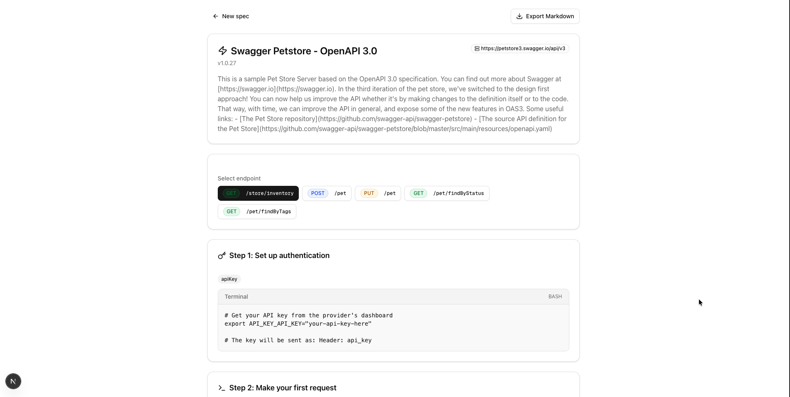
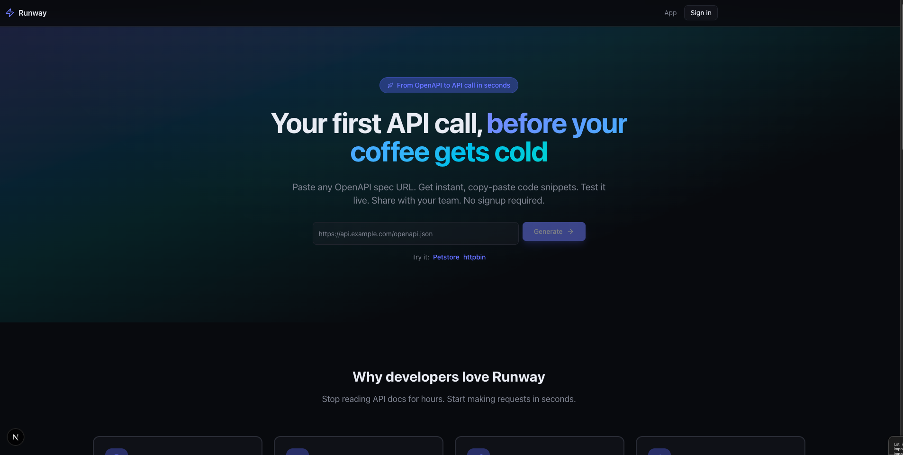
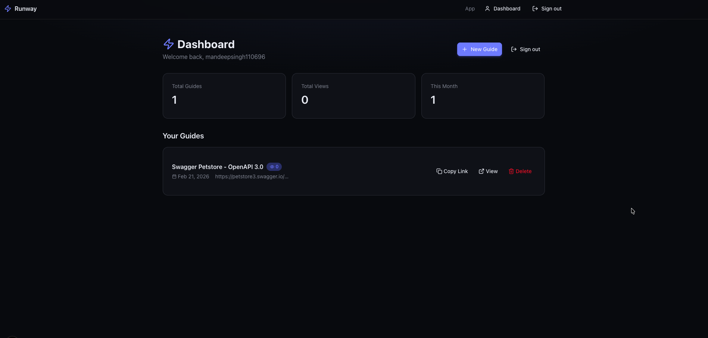
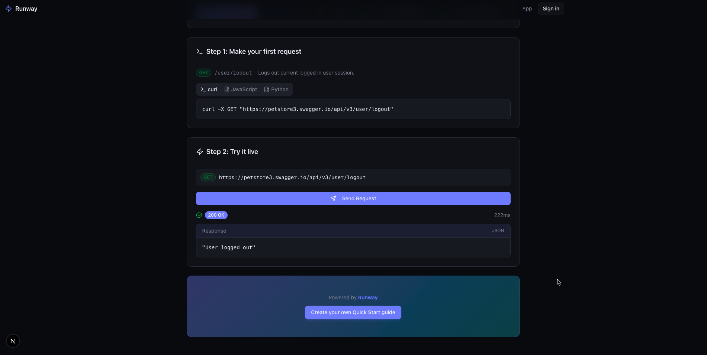

# Runway ✈️

**Stop reading API docs. Start making requests.**

Paste an OpenAPI spec URL → get a working Quick Start with copy-paste code and a shareable link. Dark UI, no signup required.



## 😩 The Problem

You find an API you want to use. The docs have 200 endpoints. You scroll for the auth section, find three auth methods, copy a curl, get a 401. Try again. Sound familiar?

## ✨ The Solution

Runway reads the OpenAPI spec and does the work for you:

- 🎯 **Picks a simple first endpoint** – e.g. `/health`, `/me` – so you can hit it right away
- 🔐 **Detects auth** – API key, Bearer, OAuth2 – and tells you what to set
- 📋 **Generates working code** – Copy-paste curl, JavaScript, or Python
- 🔗 **Shareable links** – Each guide gets a short link you can share
- ⚡ **Try it live** – Call the API from the browser and see the response

## 🚀 Quick Start

```bash
pnpm install
pnpm dev
```

Open **http://localhost:3000** (or the port shown in the terminal). Paste any OpenAPI spec URL on the landing page or go to **/app** to use the tool.



**Try it with:**
- **HTTPBin:** `https://httpbin.org/spec.json`
- **PetStore:** `https://petstore3.swagger.io/api/v3/openapi.json`

## 🔄 How It Works

```
You paste a spec URL  →  Server parses it  →  You get a Quick Start
   • Auth setup
   • Code snippets (curl / JS / Python)
   • Share link (/g/xxxxx)
   • Interactive Try It panel
```

Parsing runs server-side. You can sign in (magic link or GitHub) to save guides to your dashboard.

## 📊 Dashboard

Sign in to see your saved guides, copy share links, and track views.



## ⚡ Try It Live

Test any endpoint from your browser. No terminal or Postman needed.



## 🛠️ Built With

- **Next.js 16** – App Router, React Server Components, Turbopack
- **TypeScript** – Type safety
- **Tailwind CSS + shadcn/ui** – UI
- **Supabase** – Auth (magic link, GitHub), DB (guides, events)
- **Biome** – Lint and format
- **@readme/openapi-parser** – Spec parsing
- **pnpm** – Package manager

## 📁 Project Structure

```
src/
├── app/
│   ├── (marketing)/page.tsx   # Landing at /
│   ├── app/page.tsx           # Tool at /app
│   ├── g/[slug]/              # Shareable guide pages
│   ├── dashboard/             # User's saved guides
│   ├── login/                 # Sign in
│   ├── auth/callback/        # OAuth callback
│   └── api/
│       ├── parse/             # Parse spec, save guide, return slug
│       ├── proxy/             # CORS proxy for Try It
│       └── analytics/         # Event tracking
├── components/                # UI + auth + share
├── lib/
│   ├── openapi/               # Parsing, snippets, auth detection
│   ├── supabase/              # Client, server, types
│   └── analytics.ts           # Event helpers
└── middleware.ts              # Auth session refresh
```

## 📄 License

MIT
